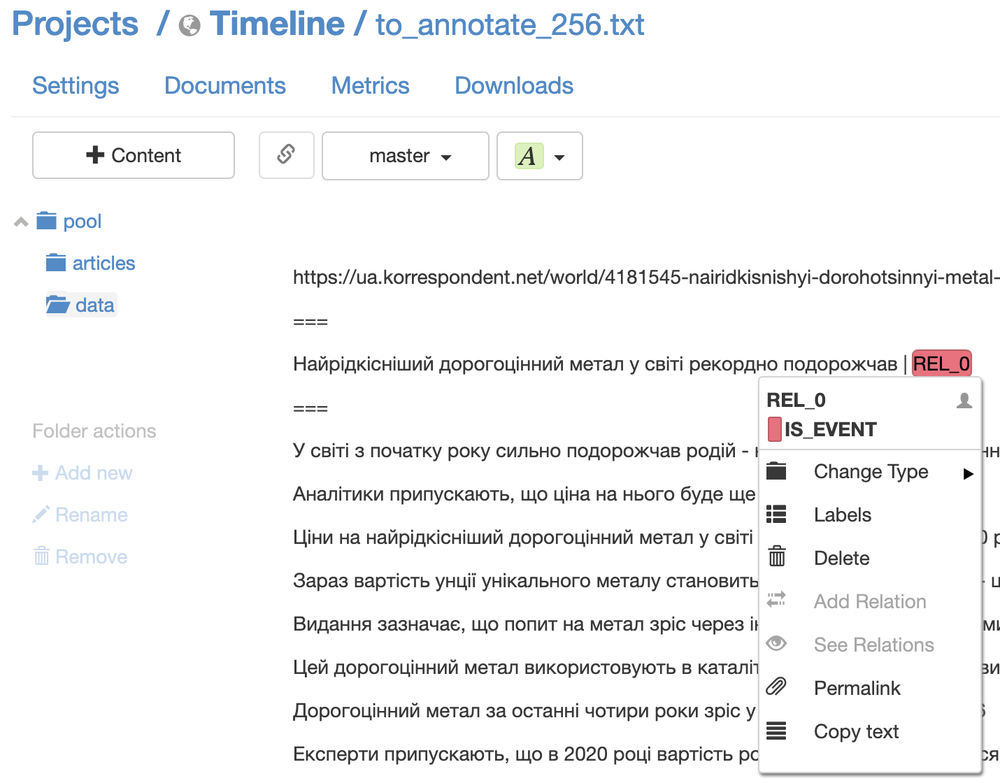

# Course project for [NLP course](https://github.com/vseloved/prj-nlp-2020)

## Тема курсового проекту

"Побудова хронології подій у новинах, пов’язаних із заданим об’єктом"

## Дані

Тренувальні дані були наскрейплені з українських новинних сайтів (https://korrespondent.net, https://www.pravda.com.ua, https://www.liga.net, а також компанія Semantrum дала трохи своїх даних). Всього - близько 13000 новин

На жаль, проанотовано було лише близько 1500 статей, із яких вийшло трохи більше 3000 прикладів. Основний критерій анотування - чи є новина подією

## Метрики

Класифікатор має визначити, чи новина є подією, чи ні. Основні метрики: precision, recall, та, як результат, f1-score

## Реалізація

### Класифікатор

Було натреновано модель LogisticRegression класифікатора. В якості фіч використані структурні особливості побудови речень: наявність патерну subject-predicate-object та їх частин мови, час присудка (якщо це дієслово), наявність дат та ключових слів, тощо.

Якість:

```
              precision    recall  f1-score   support

       False       0.78      0.57      0.66       458
        True       0.71      0.87      0.78       564

    accuracy                           0.73      1022
   macro avg       0.75      0.72      0.72      1022
weighted avg       0.74      0.73      0.73      1022
```

### Workflow

Користувач вводить певне слово в якості пошукового запиту, система шукає новини за цим запитом та відфільтровує їх, повертаючи тільки ті, що вона вважає за подію. Результат відобраєаться у вигляді таймлайну

## Інструменти

1. Для скрейпингу даних - утиліта [Apify](https://apify.com/)
2. Для анотування - [TagTog](https://www.tagtog.net/) (потім ще довго довелось писати парсер для проанатованих `.tsv`-шок...)

Ось приклад, як виглядає документ із анотацією:


3. Для пошуку новин - гугл сьорч апішка від [SerpWow](https://serpwow.com/)
4. Бекенд - простенький HTTP сервачок на `python`
5. Фронтенд - юайка на `TypeScript`, `React`, для візуалізації таймлайну - [react-vertical-timeline](https://github.com/stephane-monnot/react-vertical-timeline)
